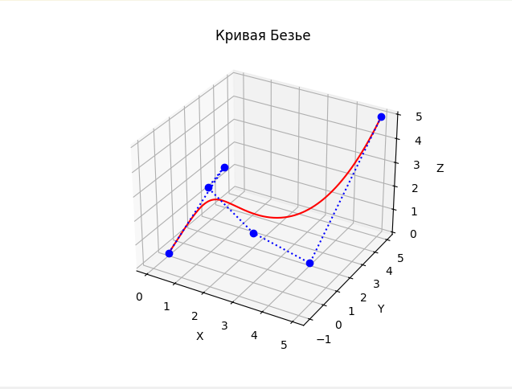
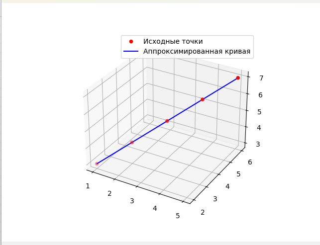

# Bezier_Calculation
 
1. Кривая Безье на основе заданных контрольных точек и визуализирует её в трехмерном пространстве

2. Аппроксимированная кривая на основе заданных опытных данных и визуализирует её в трехмерном пространстве
